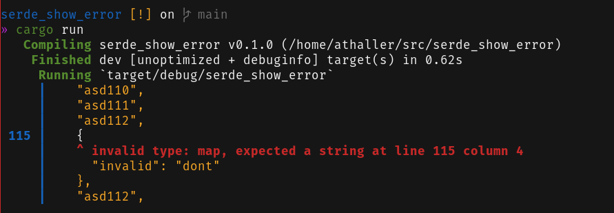

# format_serde_error

[](https://github.com/AlexanderThaller/format_serde_error/actions?query=workflow%3ARusteain)
[](https://crates.io/crates/format_serde_error)
[](https://docs.rs/format_serde_error)

Format serde errors in a way to make it obvious where the error in the source file was.

Currently [serde_yaml](https://github.com/serde-rs/json) and
[serde_json](https://github.com/dtolnay/serde-yaml) are supported. Extending the
library to more data types should be relativly easy as long as the errors
emit a line and column.



Usage Example:

```rust
use format_serde_error::SerdeError;

#[derive(Debug, serde::Serialize, serde::Deserialize)]
struct Config {
    values: Vec<String>,
}

fn parse_config() -> Result<Config, anyhow::Error> {
  let config_str = "values:
  - 'first'
  - 'second'
  - third:";

  let config = serde_yaml::from_str::<Config>(config_str)
    .map_err(|err| SerdeError::new(config_str.to_string(), err))?;

  Ok(config)
}
```

The output will be:

```
Error:
   | values:
   |   - 'first'
   |   - 'second'
 4 |   - third:
   |           ^ values[2]: invalid type: map, expected a string at line 4 column 10
```
