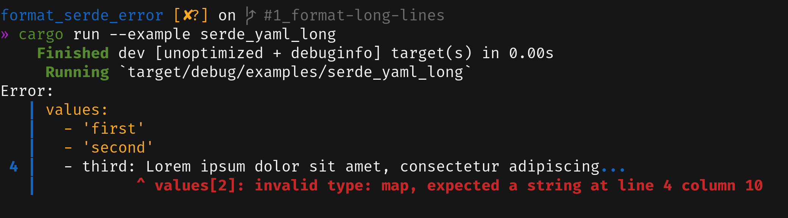
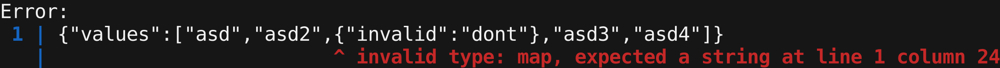
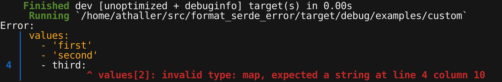

# format_serde_error

[](https://github.com/AlexanderThaller/format_serde_error/actions?query=workflow%3ARusteain)
[](https://crates.io/crates/format_serde_error)
[](https://docs.rs/format_serde_error)

Serde error messages for humans.

Format serde errors in a way to make it obvious where the error in the source file was.


Add this to your Cargo.toml:

```toml
[dependencies]
prometheus_exporter = "0.3"
```

Currently [serde_yaml](https://github.com/serde-rs/json) and
[serde_json](https://github.com/dtolnay/serde-yaml) are supported. Extending the
library to more data types should be relativly easy as long as the errors
emit a line and column.

Also has a custom error type which supports printing a message with a given
line and column (see [examples/custom.rs](examples/custom.rs)).

Usage Example (from [examples/serde_yaml.rs](examples/serde_yaml.rs)):

```rust
use format_serde_error::SerdeError;

#[derive(Debug, serde::Serialize, serde::Deserialize)]
struct Config {
    values: Vec<String>,
}

fn main() -> Result<(), anyhow::Error> {
    let config_str = "values:
  - 'first'
  - 'second'
  - third:";

    let config = serde_yaml::from_str::<Config>(config_str)
        .map_err(|err| SerdeError::new(config_str.to_string(), err))?;

    dbg!(config);

    Ok(())
}
```

The output will be:

```
Error:
   | values:
   |   - 'first'
   |   - 'second'
 4 |   - third:
   |           ^ values[2]: invalid type: map, expected a string at line 4 column 10
```


The crate will also shorten long lines if necessary (from
[examples/serde_yaml.rs](examples/serde_yaml.rs)):
```
Error:
   | values:
   |   - 'first'
   |   - 'second'
 4 |   - third: Lorem ipsum dolor sit amet, consectetur adipiscing...
   |           ^ values[2]: invalid type: map, expected a string at line 4 column 10
```



The amount of context for lines and characters can be controlled globally and
per error. See documentation for how to do that. Adding context and shortening
the lines can also be disabled.

## Crate Features

### `serde_yaml`
*Enabled by default:* yes

Enables support for errors emitted by `serde_yaml`.

### `serde_json`
*Enabled by default:* yes

Enables support for errors emitted by `serde_json`.

### `colored`
*Enabled by default:* yes

Enables support for color output to a terminal using the `colored` crate.

### `graphemes_support`
*Enabled by default:* yes

Enables proper support for grapheme cluster when contextualizing long error lines.

## Examples

### serde_json


### serde_json_long


### serde_yaml


### serde_yaml_long


### custom

